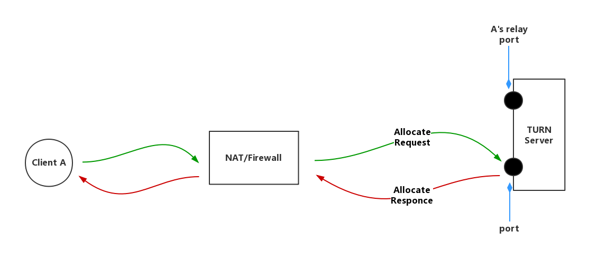
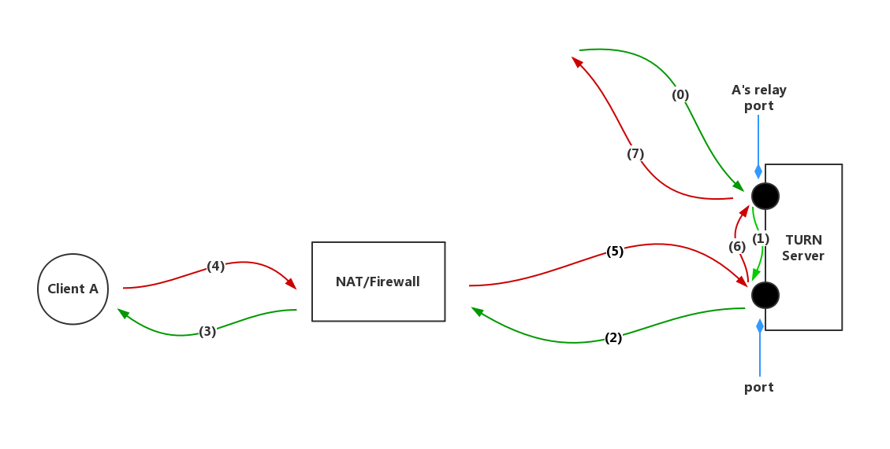
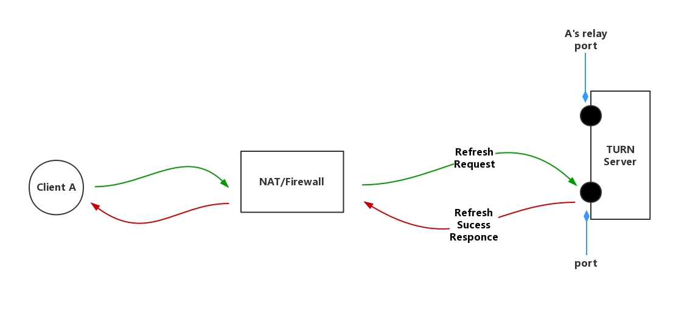
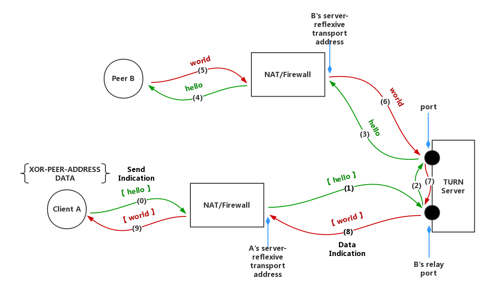
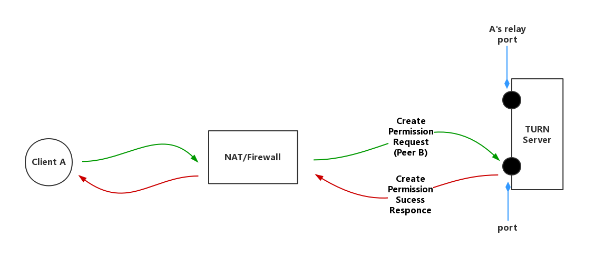
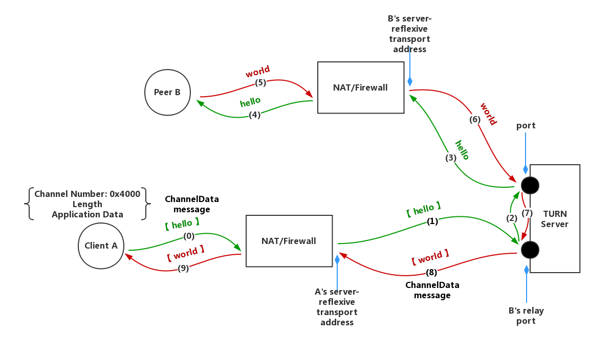
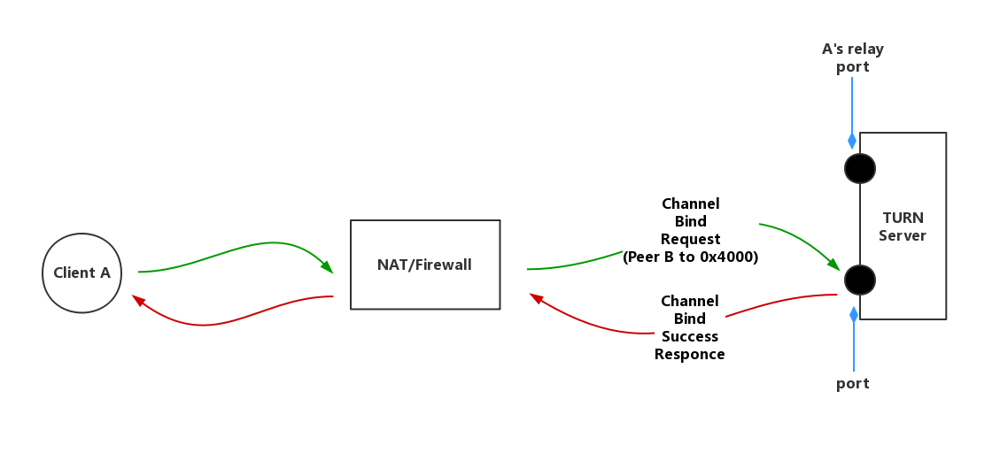

# TURN-Server Docs

> Written by Du RuYao for Cai ZhiTong.

## 1. 理论基础

这里有在接手**转发服务器**之前，你要知道的。

### 1.1. 浅谈 P2P & STUN & TURN 

你需要对 P2P 有一定的了解，但不必过于深入。

- [P2P通信原理与实现](https://zhuanlan.zhihu.com/p/26796476)

- [P2P标准协议之STUN](https://zhuanlan.zhihu.com/p/26797664)

- [P2P标准协议之TURN](https://zhuanlan.zhihu.com/p/26797422)

### 1.2. TURN 协议

必要的情况下，你可能需要深入 TURN 协议，下面的文档详细且方便查阅，里面有你想知道的一切。不急于完全理解，遇到底层问题时，记得回来读它。

- [Traversal Using Relays around NAT (TURN)](https://tools.ietf.org/id/draft-ietf-behave-turn-08.html)

## 2. 工作机制

若你看过了我推荐的文章，应该对**转发服务器**有了一些了解，结合下述图解与上述理论基础，希望帮你更深入。

### 2.1. Allocate

- 客户端发送Allocate请求给TURN服务器，请求服务器为A客户端开启一个relay端口。

- 若该请求不含验证信息，服务端回复error responce。

- 客户端收到错误请求的回复后，携带验证信息再次请求。

- 若请求被成功响应，服务端回复的response中包含XOR-RELAYED-ADDRESS属性，是分配给客户端的relay端口的异或结果。

- 客户端A获得一个公网IP作为relay address，所有传递给A的信息都要发送到此地址。

### 2.2. Forward

- 与客户端A建立连接的其他客户端，应先将信息发送到A的relay端口，再由TURN服务器通过其他端口发送给A。

- A回复信息时，原路返回。

### 2.3. Refresh

- 服务端分配的relay address具有一定的时长，为了长期有效，客户端需发送refresh请求刷新剩余时间。

- 服务端响应消息中含有Life Time属性，表示relay address剩余时间。

- 客户端可以在存活期内调用REFRESH请求。

- 服务端受到REFRESH请求后，刷新relay address剩余时间。

- 当REFRESH请求中的LifeTime属性为0时，Client主动要求关闭relay地址。

### 2.4. Send / Data Mechanism

- client与peer通过TURN server有两种方式交换信息，一种是通过Send/Data Indication，一种是通过Channels。

- Send Indication告知TURN服务器哪个peer接受信息，Data Indication告知client信息来自于哪个peer。

- Send/Data Indication都对原始裸数据包进行封装，即添加STUN头部，如(0)，(8)。

- 其中Send Indication含XOR-PEER-ADDRESS和DATA属性，前者指定peer的反射地址，后者指定信息。

- 再次其强调，Client A发送信息给Peer B要先发送到B的relay address。

- Send/Data Indication是不支持验证的，为了防止攻击, TURN要求client在给对等端发送indication之前先安装一个到对等端的许可。

- 关于创建许可，Client A发送关于Peer B的create permission request到TURN服务器，并收到创建成功的responce。

### 2.5. Channels Mechanism

- 信道机制是client与peer通过TURN server有两种方式交换信息的另一种方式。

- Send/Data Indication中多加的36字节信息会加重客户端和服务端之间的带宽压力，所以该方法使用另一种数据包格式ChannelData message。

- ChannelData message不使用STUN头部，使用一个4字节的头部,包含了一个称之为信道号的值(channel number)，每个信道号都与一个特定的Peer绑定，作为对等端地址的一个记号。

- 要将一个信道与对等端绑定,Client发送一个信道绑定请求到服务器,并且指定一个未绑定的信道号以及对等端的地址信息。

- 信道绑定存在默认时间，Client可以通过重新发送刷新请求来刷新剩余时间。

- 和Allocation不同的是，信道绑定没有直接删除绑定的方法，只能等待其超时自动失效。

## 3. 安装

关于TURN协议，有很多实现，`turnserver` 是对其在服务端的实现之一，也是我们在使用和要掌握的那个。

### 3.1. 下载

目前使用的版本为 `turnserver-3.2.3.95`, 也可以编译安装其他版本做性能上的对比。

- [turnserver 各个版本源代码](http://turnserver.open-sys.org/downloads/)

### 3.2. 编译安装

为保持与线上环境一致，建议在 [CentOS]() 下编译安装(事实上，明确楚依赖，大部分Linux发行版都可以)。

- [turnserver 服务端部署(优先参考)](https://www.kancloud.cn/vim26/v1/578933)

- [Install Turnserver In Ubuntu(我整理的)](https://gitlab.com/graycat0918/turn-server-docs/install_docs/install_turnserver.html)

编译安装过程中可能出现的问题(我更希望一切顺利)。

- [OpenSSL Crypto development libraries are not installed properly in required location
](https://unix.stackexchange.com/questions/523193/openssl-crypto-development-libraries-are-not-installed-properly-in-required-loca)

- [Cannot bind TCP/TLS listener socket to addr XX.XX.XX.XX:3478](https://unix.stackexchange.com/questions/523240/cannot-bind-tcp-tls-listener-socket-to-addr-xx-xx-xx-xx3478)

更多问题请咨询 [stackoverflow](https://stackoverflow.com/) 以及 [Stack Exchange](https://stackexchange.com/)。

## 4. 部署

### 4.1. 概览

那些部署前你需要了解的，详见官方 README。

- [github readme of turnserver](https://github.com/coturn/coturn/wiki/README)

### 4.2. 服务端参数

turnserver 的具体参数配置详见官方 Wiki，请仔细阅读。

- [github wiki of turnserver](https://github.com/coturn/coturn/wiki/turnserver)

### 4.3. 客户端 Demo

turnserver 编译生成多个程序，`bin/` 目录下除了我们要特别关注的 `turnserver`、`turnadmin` 外，还包括了客户端 Demo `turnutils_uclient` 与对等端 Demo `turnutils_peer` 。利用如上 Demo 可以更方便测试(如丢包率)，也可以阅读代码知晓客户端(对等端)对 TURN 协议的实现。

客户端 Demo 的具体参数配置详见官方 Wiki。

- [github wiki of turnutils_uclient](https://github.com/coturn/coturn/wiki/turnutils_uclient)

### 4.4. 对等端 Demo

服务端 Demo 的具体参数配置详见官方 Wiki。

- [github wiki of turnutils_peer](https://github.com/coturn/coturn/wiki/turnutils_peer)
