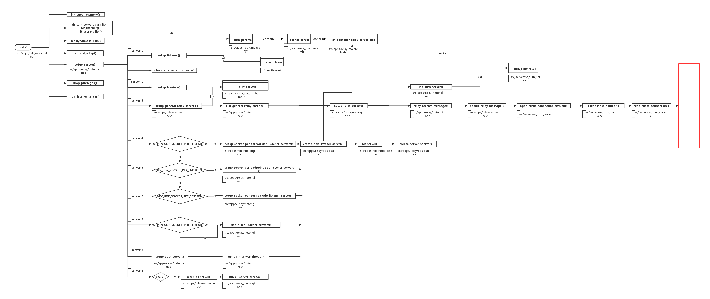

# TURN-Server Docs

> The docs is written by Du RuYao for new guy.

## 1. 理论基础

这里有在接手**转发服务器**之前，你所要知道的。

### 1.1. 浅谈P2P 

你需要对P2P有一定的了解，但不必过于深入（但请读完）。

- [P2P通信原理与实现](https://zhuanlan.zhihu.com/p/26796476)

- [P2P标准协议之STUN](https://zhuanlan.zhihu.com/p/26797664)

- [P2P标准协议之TURN](https://zhuanlan.zhihu.com/p/26797422)

### 1.2. TURN协议

必要的情况下，你可能需要深入TURN协议，下面的文档详细且方便查阅，里面有你想知道的一切。不急于完全理解，遇到问题时，回来读它。

- [Traversal Using Relays around NAT (TURN)](https://tools.ietf.org/id/draft-ietf-behave-turn-08.html)

---

## 2. 工作机制

若你已看过前面推荐的文章，应该对**转发服务器**有了一些了解，结合下述图解与上述理论基础，希望帮你更深入。也可以直接看我的博客文章[Turnserver Working Mechanism](https://graycat0918.github.io/2019/06/30/turnserver-working-mechanism/#more)。

### 2.1. Allocate

- 客户端发送Allocate请求给TURN服务器，请求服务器为A客户端开启一个relay端口。

- 若该请求不含验证信息，服务端回复error responce。

- 客户端收到错误请求的回复后，携带验证信息再次请求。

- 若请求被成功响应，服务端回复的response中包含XOR-RELAYED-ADDRESS属性，是分配给客户端的relay端口的异或结果。

- 客户端A获得一个公网IP作为relay address，所有传递给A的信息都要发送到此地址。

### 2.2. Forward

- 与客户端A建立连接的其他客户端，应先将信息发送到A的relay端口，再由TURN服务器通过其他端口发送给A。

- A回复信息时，原路返回。

### 2.3. Refresh

- 服务端分配的relay address具有一定的时长，为了长期有效，客户端需发送refresh请求刷新剩余时间。

- 服务端响应消息中含有Life Time属性，表示relay address剩余时间。

- 客户端可以在存活期内调用REFRESH请求。

- 服务端受到REFRESH请求后，刷新relay address剩余时间。

- 当REFRESH请求中的LifeTime属性为0时，Client主动要求关闭relay地址。

### 2.4. Send / Data Mechanism

- client与peer通过TURN server有两种方式交换信息，一种是通过Send/Data Indication，一种是通过Channels。

- Send Indication告知TURN服务器哪个peer接受信息，Data Indication告知client信息来自于哪个peer。

- Send/Data Indication都对原始裸数据包进行封装，即添加STUN头部，如(0)，(8)。

- 其中Send Indication含XOR-PEER-ADDRESS和DATA属性，前者指定peer的反射地址，后者指定信息。

- 再次其强调，Client A发送信息给Peer B要先发送到B的relay address。

- Send/Data Indication是不支持验证的，为了防止攻击, TURN要求client在给对等端发送indication之前先安装一个到对等端的许可。

- 关于创建许可，Client A发送关于Peer B的create permission request到TURN服务器，并收到创建成功的responce。

### 2.5. Channels Mechanism

- 信道机制是client与peer通过TURN server有两种方式交换信息的另一种方式。

- Send/Data Indication中多加的36字节信息会加重客户端和服务端之间的带宽压力，所以该方法使用另一种数据包格式ChannelData message。

- ChannelData message不使用STUN头部，使用一个4字节的头部,包含了一个称之为信道号的值（channel number），每个信道号都与一个特定的Peer绑定，作为对等端地址的一个记号。

- 要将一个信道与对等端绑定,Client发送一个信道绑定请求到服务器,并且指定一个未绑定的信道号以及对等端的地址信息。

- 信道绑定存在默认时间，Client可以通过重新发送刷新请求来刷新剩余时间。

- 和Allocation不同的是，信道绑定没有直接删除绑定的方法，只能等待其超时自动失效。

---

## 3. 安装 turnserver

关于TURN协议，有很多实现，开源项目`turnserver`是对其在服务端的众多实现之一，也是我们在使用和要掌握的那个。

### 3.1. 下载

目前使用的版本为`turnserver-3.2.3.95`, 也可以编译安装其他版本做性能上的对比（命令参数上会有些许不同，请仔细对比）。

- [turnserver各个版本源代码](http://turnserver.open-sys.org/downloads/)

### 3.2. 编译安装

为保持与线上环境一致，建议在[CentOS](https://www.centos.org/download/) 下编译安装（事实上，明确依赖，大部分Linux发行版都可以）。

- [turnserver服务端部署(优先参考)](https://www.kancloud.cn/vim26/v1/578933)

- [Install Turnserver In Ubuntu(我整理的)](https://gitee.com/duruyao/TURN-Server-Docs/tree/master/docs/install_turnserver_in_ubuntu.pdf)

编译安装过程中可能出现的问题（望一切顺利）。

- [OpenSSL Crypto development libraries are not installed properly in required location
](https://unix.stackexchange.com/questions/523193/openssl-crypto-development-libraries-are-not-installed-properly-in-required-loca)

- [Cannot bind TCP/TLS listener socket to addr XX.XX.XX.XX:3478](https://unix.stackexchange.com/questions/523240/cannot-bind-tcp-tls-listener-socket-to-addr-xx-xx-xx-xx3478)

更多问题请咨询[stackoverflow](https://stackoverflow.com/)以及[Stack Exchange](https://stackexchange.com/)。

---

## 4. 部署turnserver

尽管“**使用**”本身不是一件困难的事，但想要登峰造极仍要花些功夫。

### 4.1. 部署概览

那些部署前你需要了解的，详见官方`README`。

- [github readme of turnserver](https://github.com/coturn/coturn/wiki/README)

### 4.2. 服务端参数

turnserver 的具体参数配置详见官方`Wiki`，**请仔细阅读**。

- [github wiki of turnserver](https://github.com/coturn/coturn/wiki/turnserver)

### 4.3. 客户端Demo

turnserver源代码编译生成多个程序，`bin/`目录下除了我们要特别关注的`turnserver`、`turnadmin`外，还包括了客户端Demo `turnutils_uclient`与对等端Demo`turnutils_peer`。

利用如上Demo可以更方便测试（如丢包率测试），也可以阅读代码知晓客户端(对等端)对TURN协议的实现。

客户端Demo的具体参数配置详见官方`Wiki`。

- [github wiki of turnutils_uclient](https://github.com/coturn/coturn/wiki/turnutils_uclient)

### 4.4. 对等端Demo

对等端Demo的具体参数配置详见官方`Wiki`。

- [github wiki of turnutils_peer](https://github.com/coturn/coturn/wiki/turnutils_peer)

### 4.5. 压力测试

对于测试turnserver的丢包率，为了一劳永逸，我已经编写好了一个**自动化压测程序**。相信调好参数、改动极少量的代码后仍适用于你现在的情况。

如果不知道**它**在哪，请咨询库的管理员。

---

## 5. turnserver代码

阅读大型开源项目是一件痛苦又痛快的事，通常来说，会有很多工具辅助理清项目的思路。但对于深入阅读**turnserver**，我不知道该推荐什么，毕竟**他**是真正的**剑道宗师**，将C语言挥舞得出神入化，任何工具都不足以解析他的刀法，除了时间。

多花些时间，每多读懂一行，你的刀法将更精进一点。

### 5.1. 程序入口

你已经知道了turnserver源代码会编译生成多个二进制可执行程序，而我们最关注的`turnserver`的程序入口`main()`在`src/apps/relay/mainrelay.c`中。

### 5.2. 函数调用

下图并不是一张完整的函数调用图，希望能对你有**一点点**的帮助（我对此十分不确定）。

请在新标签页查看大图。

### 5.3. 其他开源库

在turnserver源代码中多次用到了[OpenSSL](https://www.openssl.org/)、[libevent](https://libevent.org/)，事实上在**安全通信**与**多路IO复用**上，他们的确很好用。

去了解他们，不止现在，以后也用得到。

### 5.4. 其他协议

你在服务端的网络编程已经开始了，接触越来越多的协议是不可避免的。

比如这两个，教科书中很少提及却很常用。其他的靠积累吧。

- [SSL](https://baike.baidu.com/item/SSL)

- [TLS](https://zh.wikipedia.org/wiki/%E5%82%B3%E8%BC%B8%E5%B1%A4%E5%AE%89%E5%85%A8%E6%80%A7%E5%8D%94%E5%AE%9A)

---

## 6. 位置&作用

通过阅读下面的文档，了解转发服务器在整个系统中的地位和作用。

- [三级联动指挥处理系统文档](https://gitee.com/duruyao/TURN-Server-Docs/tree/master/docs/)

## 7. 其他

我的一个公开库，收藏有关IT的电子书（中文、英文、有标签、无标签），会持续更新，欢迎提交，分享你的爱书。

抵制盗版，支持正版，劳动成果值得尊重，追求知识无可厚非。

- [ebooks of graycat0918](https://github.com/graycat0918/ebooks)

